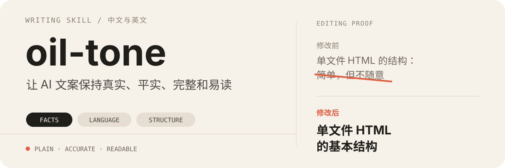

<p align="center">
  
</p>

<p align="center">
  <a href="https://github.com/Aafff623/tta-tone/releases/tag/v0.0.3"></a>
  <a href="https://github.com/Aafff623/tta-tone/wiki"></a>
  <a href="./LICENSE"></a>
  <a href="https://github.com/Aafff623/tta-tone"></a>
</p>

`tta-tone` 是 threetwoa 的个人文风 Skill。同一套逻辑和人情味，按分支和语气去润色 Agent 回复、文章、演讲或正式答辩。成稿跟金样本：经验稿先核现场格子，开篇有主语，主语不是「我在写这篇」。对话才嵌现成颜文字混排。语气可扩充：没点名走默认，点名走热情或官方；新人格先长训再登记。复杂场面按线索抽招式（收窄、先引后判、决策壳），不要口头报层号。页面、动画、配图写完再交接姐妹 Skill。不写营销号召、课表腔和无主句开场。

当前公开版本 **0.0.3**。品牌是 threetwoa，源仓在 [Aafff623/tta-tone](https://github.com/Aafff623/tta-tone)。说明书在 [Wiki](https://github.com/Aafff623/tta-tone/wiki)。

## 三种任务

| 分支 | 何时用 | 骨架 |
| --- | --- | --- |
| 成稿 | 润色、改写、博客、演讲、PPT 文案、网站、简介、答辩稿 | 时间线、干活例子、再请人进来摊货；官方语气零调味 |
| 讲授 | 分析模块、讲知识、带看代码 | 先把人放进场合，通俗解开，停在下一步 |
| 答问 | 怎么办、要不要、下一步怎么选 | 先接你卡在哪，再给可执行结论 |

读者成稿是否加混排，跟语气和场合走：闲聊、简单确认同一则最多两处；其余嵌在正文转折一处；官方、SKILL、README、commit 不加。

## 招式和交付

用户只点名分支和语气。轻 / 述 / 拆不是第三根要填的轴。细则在 `skills/tta-tone/references/layers.md`。

线索命中再抽招式：在比整份工具时先收窄；有原话或报错先整段引；多条路都走得通时用决策壳；成稿写完再问两句（还像不像壳、有没有多出材料没有的事实）。

默认停在 Markdown。用户点名分享页、翻页、动画、插画或封面时，再交接 `tta-html` / `tta-ppt` / `tta-motion` / `tta-visual` / `tta-cover`。专业架构走可编辑结构图，不要用生图模型冒充。

## 两套外挂

| 库 | 何时打开 | 不要 |
| --- | --- | --- |
| `references/voice/` | 成稿、润色经验稿。只读 `lexicon.md` | 把台账项目细节套到无关任务；把全文糊进 Skill；在本 Skill 里写维护步骤 |
| `references/kb/` | 讲开发、agent 怎么干活、何时停 | 当成第四张嘴；成稿找开口 |

词表写入由博客仓 `knowledge-output` 在发布时做。改完用 `tta-sync-harness` 联接，不要拷 `SKILL.md`。

## 语气（可扩充）

| 语气 | 何时用 |
| --- | --- |
| 默认 | 没点名。成稿跟金样本；讲授 / 答问先写谁在做什么；长短句错落；混排只嵌对话转折 |
| 热情 | 用户说热情、活泼、旧风格。先应一声再接问题 |
| 官方 | 正式汇报、答辩、公文。事实起笔，零调味 |

新人物语气按 `references/modes.md`「怎么加一档」登记，不要另开 Skill。

## 对话收尾和调味

编程工具里的对话回复，末尾用横式两列表格：

| now | before |
| --- | --- |
| 这一则做了什么 | 上一则已经完成什么 |

表格下方用引用框写碎碎念，并补一句迄今为止整段对话的摘要。

默认和热情把现成混排嵌在正文转折上（原因说完、下一步出来的那一下），不要只贴在末尾。闲聊、简单确认最多两处；其余一处。先认这一则的处境，再运行：

```bash
python skills/tta-tone/scripts/season.py --scene peek
```

| 这一则实际在干什么 | `--scene` |
| --- | --- |
| 做完，下一步是去看、去用 | `done` |
| 做完或做到一半，还要点未做项 | `peek` |
| 材料不够、判断没落地 | `think` |
| 和文档、预期、上一则说法不一致 | `surprise` |
| 先这样、本轮收住 | `tea` |
| 明确交给对方看、标、刷新 | `wait` |
| 只记下指令，下一则才动手 | `ack` |
| 挑样子、看陈列这类轻维护 | `play` |

本会话已经贴过的混排加 `--exclude`。同一条组合只用一次。不要手搓 `(・ω・) ✨` 这类输入法常见组合。细则在 `skills/tta-tone/references/seasoning.md`。

## 修改效果

| 常见写法 | tta-tone 的处理 |
| --- | --- |
| `主流 AI Coding Agent：先选工作方式` | `主流 AI Coding Agent 的工作方式` |
| `单文件 HTML 的结构：简单，但不随意` | `单文件 HTML 的基本结构` |
| `先把流程搞顺` | 说明需要检查、修改或确认的具体对象 |
| `真正重要的是，我们理解了工具的边界` | 内容说明完成后直接结束 |

这些修改不是为了把句子统一改短，而是删除材料没有支持的态度、节奏和升华，让标题与正文继续提供有效信息。

## 它会检查什么

- 事实是否来自现有材料，第一人称内容是否有依据。
- 面向读者时，是否根据情况自然使用「我们」或「大家」。
- 动词和对象是否准确，是否存在 `搞顺`、`跑起来` 等含糊动作。
- 句子语法、因果关系和操作过程是否完整。
- 标题是否直接说明内容，而不是自行制造文案感。
- 开篇是否有主语：谁、在什么场合、碰到什么。
- 是否把原因说够再解开，结尾是否多了营销号召或课表腔。
- 讲授时判断是否来自当前仓库，是否停在对方下一步能做的事。
- 建议是否落到具体对象。
- 默认/热情是否把混排嵌在正文转折；官方 / 风险是否误加了混排。

文件成稿用 `tone_lint.py`。程序只能识别已知套话，通读不能省。

## 安装

仓库中的 Skill 位于 `skills/tta-tone/`。远程是 `Aafff623/tta-tone`。

```bash
git clone https://github.com/Aafff623/tta-tone.git
```

Codex：

```bash
python3 ~/.codex/skills/.system/skill-installer/scripts/install-skill-from-github.py \
  --repo Aafff623/tta-tone \
  --path skills/tta-tone
```

手动安装：

```bash
cp -R tta-tone/skills/tta-tone ~/.codex/skills/tta-tone
```

安装后，在下一轮任务中使用 `$tta-tone` 调用。

## 使用

```text
使用 $tta-tone，把这份产品介绍改成可以直接发布的中文成稿。
```

```text
使用 $tta-tone，用我的语气讲清当前仓库里这个模块做什么、该打开哪些文件。
```

```text
使用 $tta-tone --语气 官方，把这段改成答辩用的说明。
```

```text
使用 $tta-tone，按现有材料给建议：要不要为这件事新开一个 Skill。
```

讲授和答问的顺序在 `skills/tta-tone/references/modes.md`。

## 脚本

只使用 Python 标准库。本机运行用 `python`。

```bash
python skills/tta-tone/scripts/tone_lint.py draft.md
python skills/tta-tone/scripts/tone_lint.py --self-test
python skills/tta-tone/scripts/season.py --scene tea --exclude "(´∀`)b👍"
python skills/tta-tone/scripts/season.py --self-test
```

`FAIL` 会让 lint 失败；`WARN` 对照上下文，有真实限定作用的可以留。

## 仓库结构

```text
tta-tone/
├── assets/readme/hero.svg
├── skills/tta-tone/
│   ├── agents/openai.yaml
│   ├── references/identity.md
│   ├── references/canon.md
│   ├── references/layers.md
│   ├── references/modes.md
│   ├── references/seasoning.md
│   ├── references/voice/
│   ├── references/kb/INDEX.md
│   ├── references/kb/sources.md
│   ├── references/kb/craft/
│   ├── references/kb/explore/
│   ├── evals/evals.json
│   ├── references/data/kaomojikan-emoji.json
│   ├── references/data/season-catalog.json
│   ├── scripts/season.py
│   ├── scripts/tone_lint.py
│   └── SKILL.md
├── CHANGELOG.md
├── LICENSE
├── README.md
└── VERSION
```

## 贡献

如果你发现一类稳定出现的 AI 文案问题，可以提交 Issue 或 PR。请同时提供：

1. 原句。
2. 问题在哪里。
3. 更自然、准确的改法。
4. 这条规则适用和不适用的情况。

这样可以避免为了修复一个例句，增加一条会伤害其他内容的机械规则。

## License

[MIT](./LICENSE)

## 从 oil-* 迁移

1. 删除旧安装：`rm -rf ~/.codex/skills/oil-* ~/.claude/skills/oil-*`
2. 删除旧配置：`rm -rf ~/.oil-cover ~/.config/oil-motion`（按需备份 API key）
3. 重新安装：`git clone https://github.com/Aafff623/tta-tone.git`
4. 重新写入 API key 到新配置路径（`~/.config/tta-cover/`、`~/.config/tta-motion/`）
